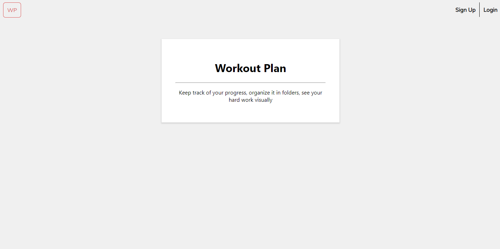
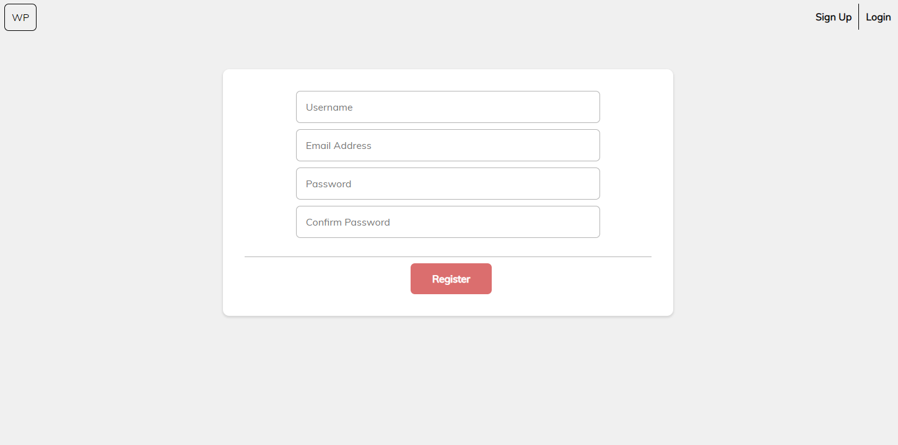
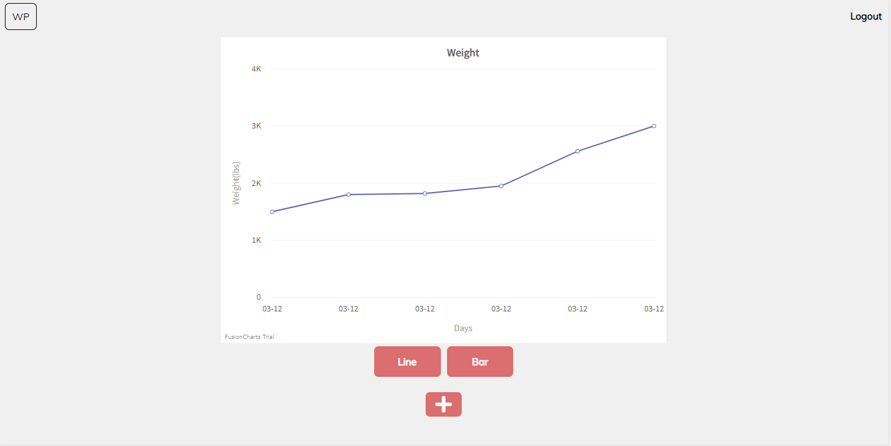

# Workout Plan
A workout log tracker that allows the user to keep all of their sessions in organized folders and see their progress visually.

### Demo Link: 
https://protected-eyrie-56416.herokuapp.com/

### Demo Account:
Email: testing@testing.com 

Password: testing

### Installation steps: 

  1. In your terminal, run **git clone https://github.com/WHATommy/workout-plan.git**
  2. Switch to TravelHelps directory(**cd workout-plan**)
  3. Retrieve the dependencies(**run npm install**)
  4. Switch into the frontend folder(**cd frontend**)
  5. Retrieve the dependencies(**run npm install**)
  6. Switch out of the frontend folder(**cd ..**)
  7. In the config/key_prod.js, insert your own noSQL database(ex. mLab) or leave as is to use a default database.
  8. From the workout-plan root directory, enter **npm run dev** to run the app on a local server
  9. Open your browser to **localhost:3000**(If it has not open automatically)

### Screenshots:

